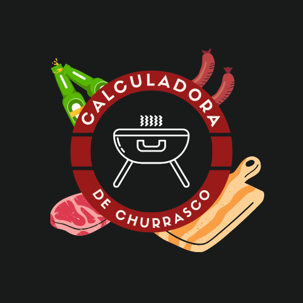

# PlanejaChurras - A calculadora de churrasco




## Sobre o projeto

Nosso projeto, o PlanejaChurras ,  é um aplicativo mobile de calculadora de churrasco feita para ajudar os amantes de churrasco da geração digital ou qualquer um que precise de auxílio para planejar sua confraternização.  

## Objetivo

Você está participando de um processo seletivo para uma vaga de desenvolvedor mobile
júnior na ACME Tecnologia cuja primeira etapa é desenvolver um aplicativo móvel para uma
calculadora de churrasco.

## Requisitos Funcionais

* Calcular e exibir o consumo individual e total de carnes e bebidas;
* Calcular e exibir o valor do rateio por pessoa (R$) com o churrasco;
* Calcular e exibir o valor total gasto (R$) com o churrasco estratificado por: carnes, bebidas, material de consumo e locação do local para o evento.
* Exibir em um mapa a localização do churrasco;
* Oferecer no mínimo três opções de carnes. Ex: Bovina, suína e frango;
* Oferecer no mínimo três tipos de carne.
* Oferecer no mínimo três opções de bebidas. Ex: Água, Refrigerante e Cerveja.
* Exibir no mínimo uma receita de cada carne oferecida no churrasco. Tomar como referência
* Indicar um local para a compra das carnes. Ex: Açougue ou supermercado;
* Exibir informações de contato do responsável pelo evento;

## Tecnologias utilizadas

<div style="display : flex; justify-content : center">
 


  
</div>


## 💻 Pré-requisitos

Antes de começar, verifique se você atendeu aos seguintes requisitos:

* Você possui o NodeJS instalado.
* Você possui o ExpoGo instalado no seu dispositivo móvel.
* Você tem uma máquina `<Windows / Linux / Mac>`, e um dispositivo móvel `<IOS / Android>`.


## 🚀 Instalando PlanejaChurras

Para instalar a Burroladora, siga estas etapas:

Clone o repositorio em uma pasta de sua escolha:
```
git clone <link do repositorio>
```

Abra o prompt de comando e caminhe até o repositorio baixado e execute o seguinte comando:
```
npm install
```

Após a instalação, execute o comando abaixo:
```
npx expo start --tunnel
```

Por fim, leia o QRCode com o seu dispositvo móvel.

## 🤝 Colaboradores

Agradecemos às seguintes pessoas que contribuíram para este projeto:

<table>
  <tr>
    <td align="center">
      <a href="#">
        <br>
        <sub>
          <b>Breno Silva</b>
        </sub>
      </a>
    </td>
    <td align="center">
      <a href="#">
        <br>
        <sub>
          <b>Amri Righetti</b>
        </sub>
      </a>
    </td>
    <td align="center">
      <a href="#">
        <br>
        <sub>
          <b>Aguirre Novaes</b>
        </sub>
      </a>
    </td>
        <td align="center">
      <a href="#">
        <br>
        <sub>
          <b>Beatriz Mendes</b>
        </sub>
      </a>
    </td>
  </tr>
</table>
